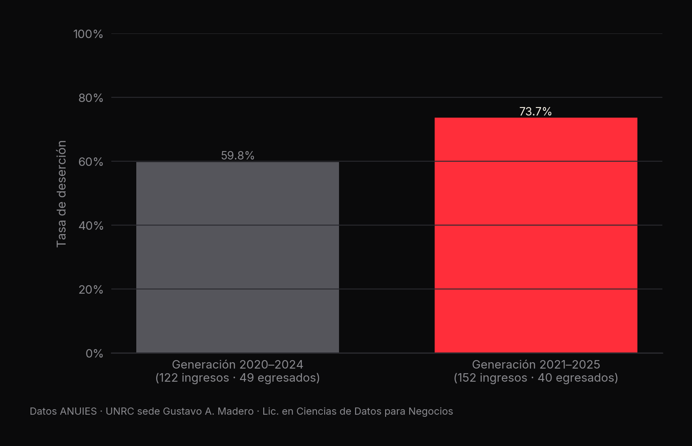
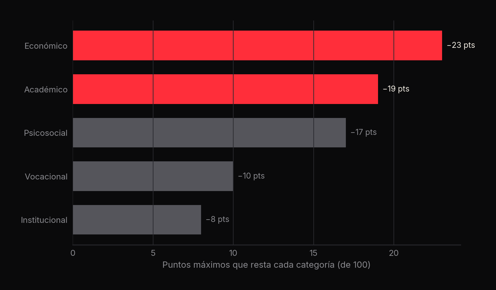
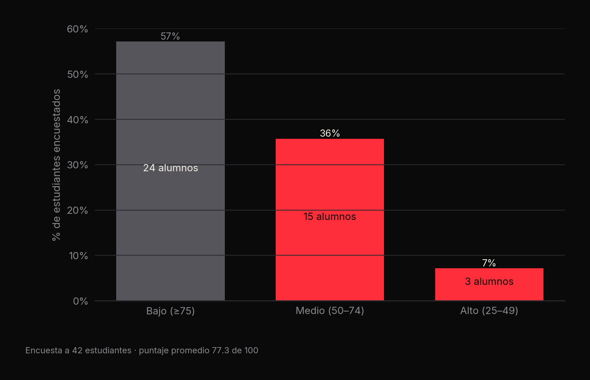

# 🎓 Deserción universitaria en la UNRC

**De cada 10 estudiantes de Ciencias de Datos para Negocios (sede GAM), entre 6 y 7 no terminan la carrera; una encuesta propia de 42 estudiantes identifica a 18 en riesgo medio o alto** · Equipo 4

[](#)
[](#)
[](#)
[](https://github.com/CatoXP/portfolio-data-science)

**Equipo 4 · Grupo PHLCDN-302 GAM · Licenciatura en Ciencias de Datos para Negocios, UNRC:**
Brandon Uriel García Sánchez · Melissa Desiree Sánchez · Samuel Ayala

## En resumen
- Tasa de deserción (datos ANUIES): **59.8%** en la generación 2020–2024 y **73.7%** en la 2021–2025.
- La mayor parte de las bajas ocurre en **primer y segundo semestre**.
- Un índice de riesgo aplicado a **42 estudiantes** clasifica a **24 en riesgo bajo, 15 en medio y 3 en alto**
  (puntaje promedio 77.3 de 100).

## 1. El problema
La UNRC es una universidad joven, sin examen de admisión, pensada para abrir el acceso a la educación superior. Su reto
es la **retención**: en el propio grupo del equipo, 40 estudiantes iniciaron primer semestre, 20 llegaron al segundo y
14 al tercero. El proyecto busca medir el fenómeno y entender sus factores (académicos, socioeconómicos,
psicosociales, vocacionales e institucionales).

## 2. Tasa de deserción por generación



| Generación | Ingresos | Egresados | Tasa de deserción |
|---|---|---|---|
| 2020–2024 | 122 | 49 | 59.84% |
| 2021–2025 | 152 | 40 | 73.68% |

Los cálculos por periodo están en `tasa_desercion_UNRC_2020_2023.ipynb`, `tasa_desercion_UNRC_2021_2024.ipynb` y en las
tablas de `datos/` (2020–2021 a 2024–2025).

## 3. Encuesta e índice de riesgo
Se aplicó un cuestionario de 25 preguntas (`respuestas_desercion.csv`, 42 respuestas) y se calculó un índice de riesgo
por estudiante (`Deserción_Escolar.ipynb`):

- Cada estudiante parte de **100 puntos** y pierde puntos por condiciones adversas en 15 de las respuestas.
- Clasificación: **Bajo** ≥ 75 · **Medio** 50–74 · **Alto** 25–49 · **Muy alto** < 25.





> El documento `Formula a calcular los datos.docx` propone además una versión ponderada del índice
> (académico 35%, socioeconómico 20%, personal 20%, vocacional 15%, institucional 10%). El notebook implementa la
> versión por puntos descrita arriba.

## 4. Base de datos
`Desercion.sql` es un volcado de MariaDB (phpMyAdmin) con las respuestas de la encuesta, para consultarlas con SQL.

## 5. Conclusiones
- La deserción es **multidimensional**: no hay una sola causa, sino la combinación de presión económica (trabajar y
  estudiar), brechas en matemáticas y programación, y expectativas distintas sobre la carrera.
- Los primeros dos semestres son el punto crítico para intervenir.
- Un índice simple, aplicado al inicio, permite identificar a quién acompañar antes de que abandone.

El análisis completo y el contexto institucional están en `INFORME EJECTIVO deserción escolar UNRC.docx`.

## 6. Estructura
```
desercion-escolar-eda/
├── EDA Tasa de abandono escolar en México.ipynb   panorama nacional por estado y género (2023–2024)
├── tasa_desercion_UNRC_2020_2023.ipynb             tasas por generación (UNRC)
├── tasa_desercion_UNRC_2021_2024.ipynb
├── Deserción_Escolar.ipynb                         índice de riesgo de la encuesta
├── respuestas_desercion.csv / .xlsx                42 respuestas de la encuesta
├── riesgo_desercion.csv / .json                    puntaje y nivel de riesgo por estudiante
├── Desercion.sql                                   volcado MariaDB de la encuesta
├── datos/                                          tablas por periodo (2020–2025)
├── images/                                         gráficas de este README
└── INFORME EJECTIVO deserción escolar UNRC.docx    informe ejecutivo del equipo
```

```bash
pip install pandas numpy matplotlib seaborn scikit-learn openpyxl
jupyter notebook Deserción_Escolar.ipynb
```

---
<sub>Proyecto académico de la Licenciatura en Ciencias de Datos para Negocios, Universidad Nacional Rosario Castellanos · [Portafolio de Brandon](https://github.com/CatoXP/portfolio-data-science)</sub>
